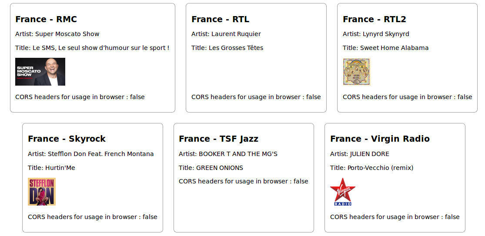

Collection of urls and parsing scripts to fetch metadata about what is being broadcast on several webradios. Provides for each radio:
* an artist
* a title
* a cover image (if available)

Code is JS only.

Note that this module gets the information from the radio websites, as most radios have a website indicating what is being broadcast live.

It could have been possible to parse [ICY metadata](http://www.smackfu.com/stuff/programming/shoutcast.html), but it is missing or broken in most situations.

## Installation
```sh
npm install webradio-metadata
```

## Command-line usage
* To display the list of compatible radios.
```sh
nodejs index.js list
```

* To check that the parsing scripts are working correctly. Empty result means success.
```sh
nodejs index.js test
```

* To get the metadata from a specific radio. If the country or the name of a radio has multiple words, use quotes.
```sh
nodejs index.js COUNTRY NAME
```
Example usages
```sh
$ nodejs index.js "France" "France Info"
{"err":null,"data":{"artist":"Le 17 | 20 : Nicolas Teillard","title":"Droit à l'erreur - Guillaume Poitrinal"},"corsEnabled":false}
```
```sh
$ nodejs index.js "France" "Radio Nova"
{"err":null,"data":{"artist":"AL GREEN","title":"LET'S STAY TOGETHER","cover":"https://nova.fr/sites/default/files/CQCT/2017-07/al-green-lets-stay-together-2893.jpeg"},"corsEnabled":true}
```

* To get metadata for all supported radios.
- Output in JSON:
```sh
nodejs index.js all-json
```
- Output in human readable format:
```sh
nodejs index.js all-human
```

## Usage as a module
```nodejs
require("webradio-metadata").getMeta(country, name, function(errors, parsedData, corsEnabled) { ... });
require("webradio-metadata").getAll(function(results) { ... });
```
## Demo webserver
A demo server and a React webapp are available in `test-server/`


## Usage in browser
This project uses Node.JS scripts and a JS web interface. Note the Node scripts cannot be put in the web interface, because some of the urls fetched do not have the CORS HTTP header ```Access-Control-Allow-Origin: *```. Ressource loading would be blocked by the browser.

## Compatible webradios
* Belgium - Bel-RTL
* Belgium - MNM
* Belgium - Radio 1
* Belgium - RTBF La Première
* Belgium - Studio Brussel
* Belgium - Zen FM
* France - Alouette
* France - BFM Business
* France - Chérie
* France - Djam Radio
* France - Europe 1
* France - FIP
* France - France Culture
* France - France Info
* France - France Inter
* France - France Musique
* France - Fun Radio
* France - Hit West
* France - Jazz Radio
* France - M Radio
* France - Nostalgie
* France - NRJ
* France - OÜI FM
* France - Radio Classique
* France - Radio FG
* France - Radio Meuh
* France - Radio Nova
* France - Radio Scoop Lyon
* France - Rire et Chansons
* France - RFM
* France - RMC
* France - RTL
* France - RTL2
* France - Skyrock
* France - TSF Jazz
* France - Virgin Radio France
* France - Voltage
* Germany - bigFM Deutschland
* Germany - Fritz
* Germany - Jam FM
* Germany - Klassik Radio
* Germany - Radio 7
* Germany - RTL Radio
* Italy - Radio 24
* Italy - Radio Capital
* Italy - Rai Radio 1
* Italy - Rai Radio 2
* Italy - Rai Radio 3
* Spain - Cadena 100
* Spain - Cadena SER
* Spain - RAC 1
* Spain - Rock FM
* Switzerland - RTS La Premiere
* Switzerland - RTS Couleur 3
* Switzerland - Spoon Radio
* United Kingdom - Absolute Radio
* United Kingdom - BBC Radio 1
* United Kingdom - BBC Radio 2
* United Kingdom - BBC Radio 3
* United Kingdom - BBC Radio 4
* United Kingdom - Kiss UK

## Contributing
You are welcome to submit a PR to add a new recipe for a radio or to fix a current recipe.
Three strategies have been used to write the recipes:
* parsing a JSON/XML API used by the radio website to dynamically update the page contents (GET or POST).
* connecting through a websocket to receive metadata.
* brute parsing the live webpage contents when no API is available.

When you have identified how to extract the data, you need to have a look at two files:
1) Radio indexes: ```parsers/COUNTRY/index.js```

Example syntax with ```COUNTRY=France``` and ```NAME=Fun Radio```:
```javascript
[
  ...
  { name: "Fun Radio", url: "https://www.funradio.fr/direct", parser: require("./RTL2") },
  ...
```
The ```name``` field should match the corresponding entry in the [radio browser wiki](http://www.radio-browser.info/gui/#/).
The ```url``` field is the path to the ressource to load.
The ```parser``` field indicates the path to the parsing script. It is most often named as the radio itself, but can be another one, when the syntax for the other radio is the same.

2) Parsers: ```parsers/COUNTRY/NAME.js```

Sample:
```javascript
"use strict";
const axios = require("axios");

module.exports = async function(exturl) {
	try {
		const req = await axios.get(exturl);
    const parsedResult = req.data;
    // const artist = ???
    // const title = ???
    // const cover = ???
		return { artist: artist, title: title, cover: cover };
	} catch (err) {
		return { error: err };
	}
}
```

## License
See LICENSE file
